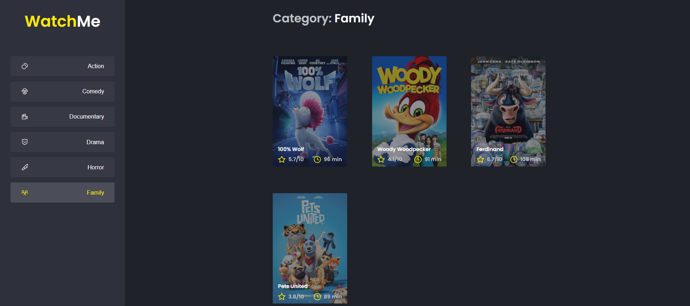

  

	
  
  
  
   
  
  

# 📖 About Project

This application is the secont challenge from the [Ignite Bootcamp](https://rocketseat.com.br/ignite).

The main objective of the challenge is to refactor a page for listing movies according to genre.

The application was already fully functional but much of its code was directly in the `App.tsx` file. It was necessary to divide the application into two main parts: sidebar and the main content that has the header and the movie listing.

- The application has only one main feature, which is the movie listing;
- In the sidebar it is possible to select which category of movies should be listed;
- The first category in the list (which is "Action") should already start as marked;
- The application's header has only the name of the selected category that must dynamically change.

# 📷 Layout

  

    
  

### 🚀 Tecnologies

- React.js
- Typescript
- SCSS

# 🔧 How to run

- Download this project to your computer or use the git command `git clone https://github.com/ferrazluana/watchme-movies.git`
- Open the folder watchme-movies in your system's shell
- Run `yarn install` to install the project's modules
- Run `yarn server` to start Fake API
- Run `yarn dev`

# :closed_book: License

This project is under the [MIT license](./LICENSE).

Give a ⭐️ if this project helped you!

#

   <b> Feito com 💖 por <a href="https://www.linkedin.com/in/luanaferraz/">Luana Ferraz</a></b>

